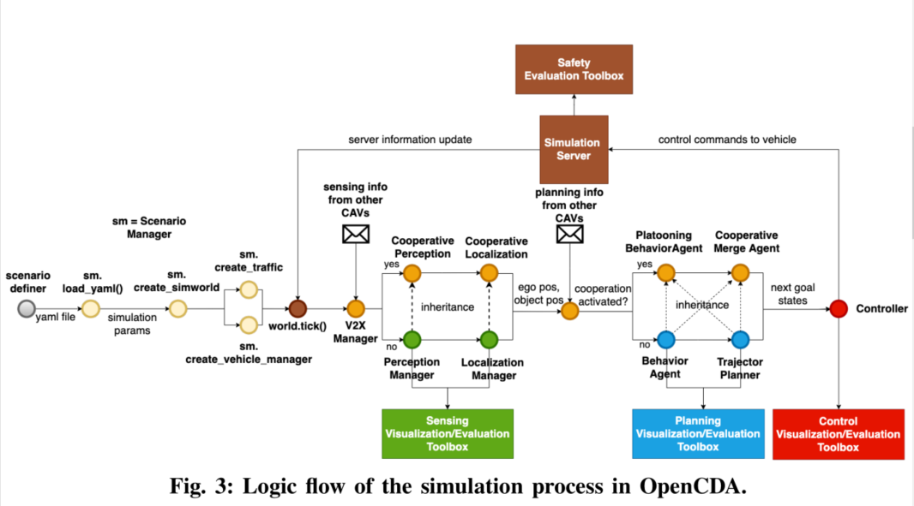
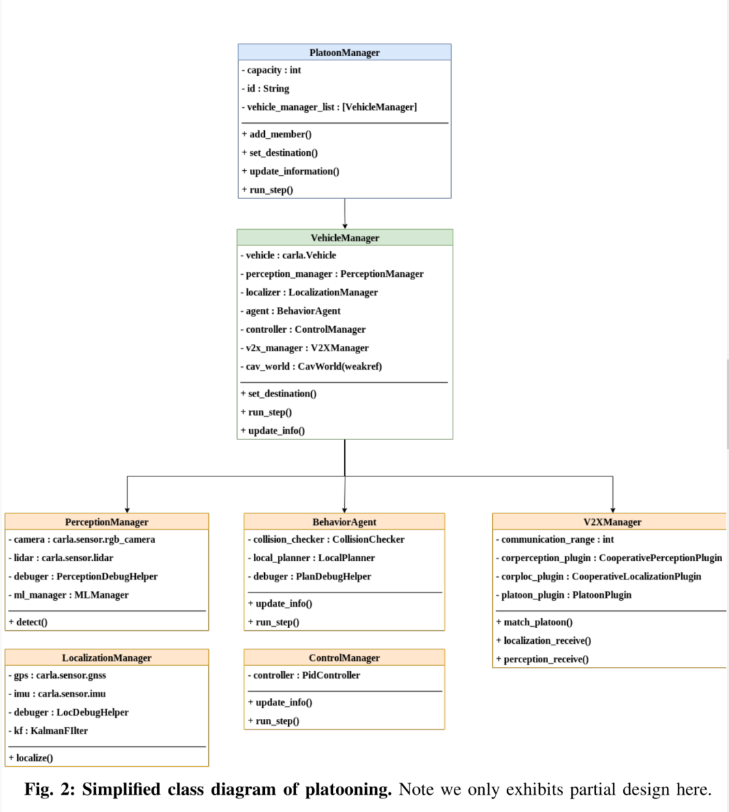

# OpenCDA 笔记

## I. User Tutorial --- Logic Flow

### 1. Codebase Structure

OpenCDA
├── docs  # documents of opencda, no need to pay attention.
├── opencda
│   ├── assests  # customized map and sumo xml package.
│   ├── co_simulation  # source codes for sumo background traffic generation.
│   ├── core  # the core part of the code
│   │   └── actutation # implementation of control algorithms
│   │   ├── application # implementation of cooperative driving applications
│   │   ├── common # base class and communication class for cavs
│   │   ├── map # HDMap manager
│   │   ├── plan # planning algorithms
│   │   └── sensing # perception adn localization algorithms.
│   ├── customize # where the users put their customized algorithm to replace the default modules
│   ├── scenario_testing # where all scenario testing scripts and yaml files exist
│   │   └── config_yaml # the yaml file defining the testing scenarios
│   │   ├── evluations # evluation scripts for different modules' performance
│   │   ├── utils # utility functions to construct scenarios based on given yaml files.
├── scripts  # installation scripts
├── tests  # unit tests

### 2. Overview
总共有五步：
1. yaml file: settings of simulation server(sync mode v.s. async mode); specifications of the traffic flow (# human driven vehicles, spawn positions); the params of each CAV
2. `Scenario Manager` loads the yaml file; delivers the necessary info to CARLA server to set simulation setting, create traffic flow, generate the CAVs. 每一个CAV被类`VehicleManager`管理
3. simulation server的的信息传给`VehicleManager`，根据对应的cooperative modules是否激活，`VehicleManager`可以选择不同的perception, localization, planning模组发送轨迹给`ControlManager`，再将control commands发送给服务端。
4. simulation server将收到的control commands应用到车上，执行一步，并将更新后的信息返还给`VehicleManager`。
5. simulation结束之后，`EvaluationManager`将评估不同模块的表现并储存统计量。




### 3. 详细介绍

#### Define the yaml file

以platoon_2lanefree_carla.yaml为例，组成的元素有以下六个：

- `world`, 
- `vehicle_base`, 
- `carla_traffic_manager`, 
- `platoon_base`, 
- `scenario`, 
- `sumo`

#### Construct Scenario (CARLA Only)

如果只考虑CARLA仿真器，则给定yaml文件之后，Scenario Manager将会加载该文件并通过`opencda.sim_api`构造场景。用户需要首先加载yaml文件到字典中并初始化`ScenarioManager`。之后生成platoons和单个CAV，`.create_platoon_manager`和`.create_vehicle_manager`。

``

```python
import opencda.scenario_testing.utils.sim_api as sim_api

# Aad yaml file into a dictionary
scenario_params = load_yaml(config_yaml)

# Create CAV world object to store all CAV VehicleManager info.
# this is the key element to achieve cooperation
cav_world = CavWorld(opt.apply_ml)

# create scenario manager
scenario_manager = sim_api.ScenarioManager(scenario_params,
                                           opt.apply_ml,
                                           town='Town06',
                                           cav_world=cav_world)
```


``

```python
# create a list of platoon
platoon_list = scenario_manager.create_platoon_manager(
        map_helper=map_api.spawn_helper_2lanefree,
        data_dump=False)

# create a list of single CAV
single_cav_list = scenario_manager.create_vehicle_manager(application=['single'])
```

之后用`.create_traffic_carla()`生成CARLA交通流。最后，创建`EvaluationManager`

``

```python
# create background traffic under Carla
traffic_manager, bg_veh_list = scenario_manager.create_traffic_carla() # autopilot=True
```

在CAVs和交通流生成之后，就可以进入仿真循环。在开始之处，调用`scenario_manager.tick()`标记服务器。

#### Construct Scenario (Co-Simulation)

构建co-simulation与单独考虑CARLA仿真器时类似，有两个区别：1）需要额外的SUMO文件；2）不需要初始化`ScenarioManager`，而是`CoScenarioManager`。

#### Execute a single step

核心类是`VehicleManager`，是任何cooperative driving applications的基类。其包含了`PerceptionManager`和`LocalizationManager`。根据某个特定的cooperative driving applications是否被激活，`VehicleManager`会选择不同的感知定位规划管理器。在运行时，`VehicleManager`先定位并检测周围目标，之后将计算后的信息传给V2X stack，planner, controller, 之后这些下游模块会融合来自不同CAVs的信息并生成轨迹和控制信息。

``

```python
class VehicleManager:
  	def update_info(self):
   	    # 1.localization
        self.localizer.localize()
        ego_pos = self.localizer.get_ego_pos() # get position of ego veh
        ego_spd = self.localizer.get_ego_spd() # get speed of ego veh
        # 2.object detection
        objects = self.perception_manager.detect(ego_pos)
        # 3. send information to v2x manager
        self.v2x_manager.update_info(ego_pos, ego_spd) 
        self.agent.update_information(ego_pos, ego_spd, objects)
        # pass position and speed info to controller
        self.controller.update_info(ego_pos, ego_spd)

    def run_step(self, target_speed=None):
        target_speed, target_pos = self.agent.run_step(target_speed)
        control = self.controller.run_step(target_speed, target_pos)
        return control
```



#### Keep the simulation loop running & Evaluation

``

```python
while True:
    world.tick()
    single_cav.update_info()
    control = single_cav.run_step()
    single_cav.vehicle.apply_control(control)
```

而evaluation manager将评估算法表现并将结果存放在`~/OpenCDA/evalution_outputs`

``

```python
# create evaluation manager
eval_manager = EvaluationManager(cav_world)
eval_manager.evaluate()
```


## II. User Tutorial ---- Traffic Generation

OpenCDA支持两种不同的方式生成背景交通流：一种是CARLA traffic manager，一个是SUMO traffic simulation. 

### CARLA traffic manager

使用CARLA生成交通流的脚本后缀都是‘carla’。生成CARLA交通流，用户需要定义yaml中的相关参数，并调用`opencda.scenario_testing.utils.sim_api.ScenarioManager`中的API。使用`ScenarioManager`生成CARLA交通流需要三行代码，其中`scenario_manager.tick()`保证traffic manager在仿真中运行。

``

```python
import opencda.scenario_testing.utils.sim_api as sim_api
# scenario_params are defined in the yaml file
scenario_manager = sim_api.ScenarioManager(scenario_params,
                                           opt.apply_ml,
                                           xodr_path=xodr_path,
                                           cav_world=cav_world)
# create background traffic in carla
traffic_manager, bg_veh_list = scenario_manager.create_traffic_carla()

while True:
    scenario_manager.tick()
```

### SUMO traffic management

该模式下，在CARLA中控制CAV，在SUMO中控制交通流。测试脚本后缀为‘cosim’。生成SUMO交通流需要三件事：1）在最开始的yaml文件中定义SUMO服务器的相关参数；2）定义SUMO路网和交通的三个文件是`xxx.sumocfg`, `xxx.net.xml`, `xxx.rou.xml`。**这里的`.net.xml`文件可以通过`xodr`文件进行转化。**

``

```shell
cd root/of/OpenCDA
python scripts/netconvert_carla.py your_map.xodr -o your_map.net.xml
```

使用`CoScenarioManager`加载SUMO文件并创建SUMO交通流。初始化中，`CoScenarioManager`将会设置好sumo服务端。在`tick`中，`CoScenarioManager`将保持SUMO生成的交通流。

## III. Developer Tutorial --- Class Design

以`platoon_joining_2lanefree_carla.py`为例（只使用CARLA）。

### CavWorld

存储CAVS和车队信息，共享的机器学习模型。若使用神经网络的话，可以将模型导入到CavWorld。

``

```python
class CavWorld(object):
    def __init__(self, apply_ml=False):
        # store the set of carla.Vehicle ids.
        self.vehicle_id_set = set()
        # store (VehicleManager.vid, VehicleManager) pairs
        self._vehicle_manager_dict = {}
        # store (PlatooningManger.pmid, PlatooningManger) pairs
        self._platooning_dict = {}
        self.ml_manager = None
        if apply_ml:
          	# add more ml models here
            self.ml_manager = function_to_load_ML_model()
```


### ScenarioManager

主要负责控制simulation construction, 背景交通流生成，CAVs生成。初始化阶段创建`client`并将高精地图加载到`self.world`

该类下的三个重要方法：`create_vehicle_manager`（常见一系列单CAV）, `create_platoon_manager`（创建编队中的车辆并创建Platoon manager对这些车辆进行编队）, `create_traffic_carla`

CAVs的信息以List形式存储在yaml文件中。


### VehicleManager

该类wrap原始的`carla.Vehicle`对象并在此基础上加上不同的模块（包括定位、感知、控制、agent, V2Xmanager）。localization模块中使用GNSS, IMU定位车辆，使用卡尔曼滤波跟踪车辆的位置和速度。感知模块使用相机激光雷达等与感知相关的传感器。如果加载ML模型，则默认使用YOLOv5识别目标。如果没有加载ML模型，则直接使用服务端的信息，并使用激光雷达过滤掉不在范围内的车辆。

agent module是核心组件。其使用感知和定位的信息生成规划轨迹，该轨迹后续会传递给下游控制器。有两类agents, 一种是`BehaviorAgent`, 一种是`PlatooningBehaviorAgent`，`BehaviorAgent`为单一车辆所设计，`PlatooningBehaviorAgent`中有方法处理编队行为。 

该类中常用的几个方法：

- `set_destination`
- `update_info`
- `run_step`
- `destroy`

### PerceptionManager

使用了相机、激光雷达、semantic LiDAR，该类的目的主要是检测。两个重要的方法是：`detect`和`retrieve_traffic_lights`

`detect`用特定的模型识别周围的车辆，如果`self.activate`激活，使用`CavWorld`中的YOLOv5识别障碍物车辆，否则直接使用服务端中的相关信息。

`retrieve_traffic_lights`从服务端直接提取交通信号灯的状态。也可以使用自定义的交通信号灯识别算法重写该方法。 

### LocalizationManager

使用与定位相关的传感器，例如GNSS和IMU，并使用卡尔曼滤波跟踪车辆的位置和速度。尽管是直接从服务端获取速度和角度信息，为了模拟真实世界的不确定性，这些数据都被加上了噪声。用户可以通过改变yaml文件中的`speed_stddev`控制噪声等级。

### BehaviorAgent

使用localization和perception的数据生成规划的轨迹。有两类规划器，分别是Local planner和global planner。global planner考虑静态地图并生成全局路径。local planner利用新感知到的数据修改全局路径以避障和遵守交通规则。

``

```python
class BehaviorAgent(object):
    def __init__(self, vehicle, carla_map, config_yaml):
      	# Load various parameters 
        ...
        self._sampling_resolution = config_yaml['sample_resolution']
        
        # collision checker
        self._collision_check = CollisionChecker(time_ahead=config_yaml['collision_time_ahead'])
       
        # used to indicate whether a vehicle is on the planned path
        self.hazard_flag = False

        # route planner related
        self._global_planner = None
        self.start_waypoint = None
        self.end_waypoint = None

        # intersection agent related
        self.light_state = "Red"
        self.light_id_to_ignore = -1

        # trajectory planner
        self._local_planner = LocalPlanner(self, carla_map, config_yaml['local_planner'])
        # special behavior rlated
        self.car_following_flag = False
        # lane change allowed flag
        self.lane_change_allowed = True
        # destination temp push flag
        self.destination_push_flag = False
        # white list of vehicle managers that the cav does not consider as
        # obstacles
        self.white_list = []
        self.obstacle_vehicles = []
```

### V2XManager

该类被用于接收其他CAVS的信息并将ego info分发给这些车辆。其中attributes `ego_pos`和`ego_speed`为deque数据类型，为了模拟信号的延迟。例如`ego_pos[3]`表示延迟了两个步长。`ego_pos[-1]`表示最近的一次步长的信息。

## IV. Developer Tutorial --- Algorithm Customization

把自定义的算法模块加入到路径`opencda/customize/...`并利用inheritance重写默认的算法。之后，将自定义的模块导入到`VehicleManager`类中。

### Localization Customization

### Perception Customization

### Behavior Planning Customization

### Control Customization

